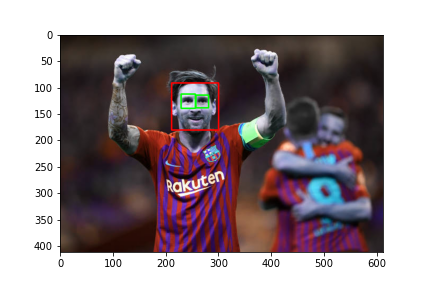
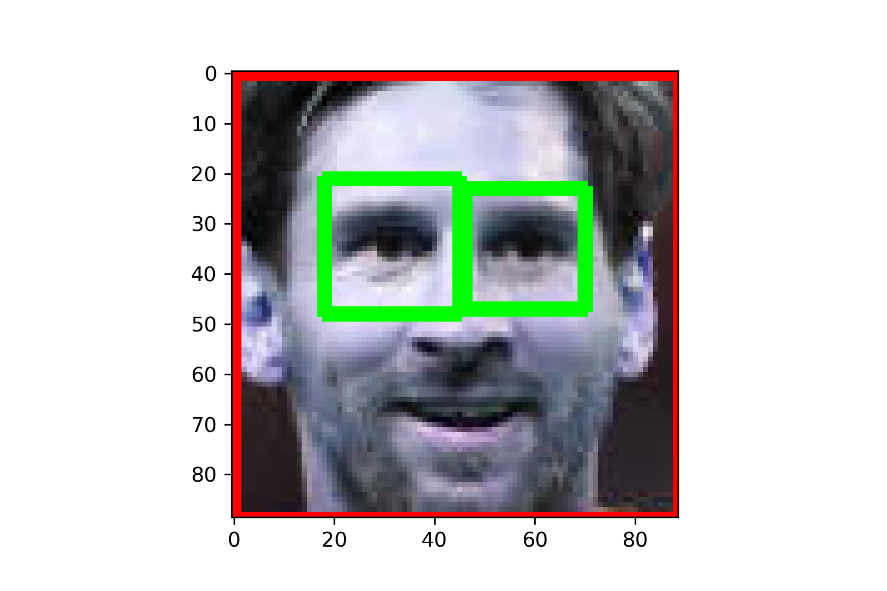
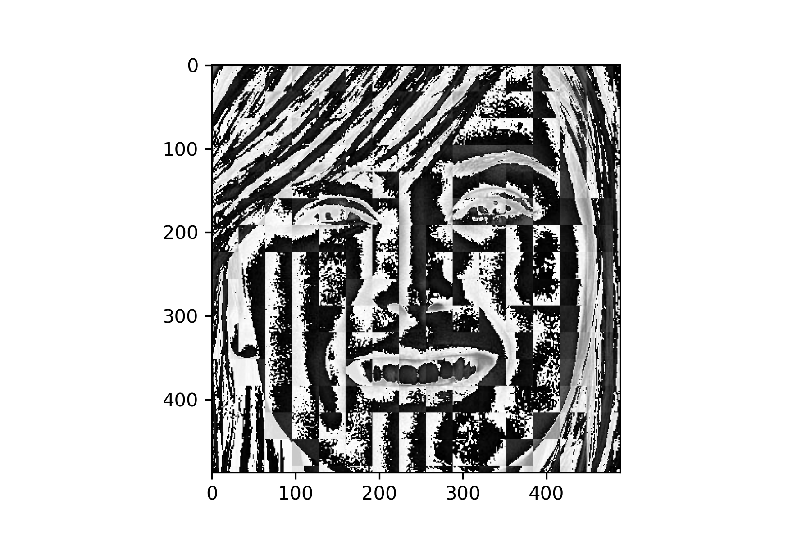

# Custom face detection using machine learning
## Table Content
1. [Project OverView](#ov)
2. [Tools](#to)
3. [Process](#pro)
4. [Final Product](#fin)

## 1. Project Overview
- In this project I've built a software that can predict the face of the people by images
## 2. Tools that i've use
- Pandas library: use to clean data and load dataset
- matplotlib and seaborn: use to visualize 
- sklearn: use to build the model espacially regression model, model_selection,train_test_split..
- Flask Framework : as a server and to make our model to be a product
- Bootstrap: use in frontend to make a beautiful intrface
- Opencv: to read image and detect the eye and face

## 3. Process
- ### first i try to dowload data image from internet
- ### Then use open cv to read the image
- ### use haar in open cv to detect the eye and face of poeple

- ### crop the image the image keep only the face and eye

- ### Use another function to convert the picture into wavelet format

because when we convert it to wavelet we can see the edge of the eye,nose,mouse more clearly
- ### Then stack the wavelet format and original format together 

## 4. Final Product

